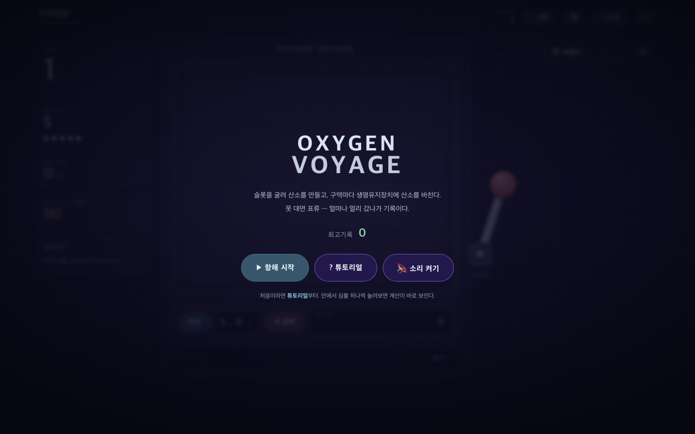

# 우주탐험

슬롯머신 로그라이크. 릴을 굴려 나온 심볼끼리 시너지를 내서 산소를 만들고, 구역이 끝날 때마다 생명유지장치에 산소를 바칩니다. 못 대면 표류 — 얼마나 멀리 갔나가 기록.



## 플레이

https://41ways.github.io/oxy-voyage/

의존성 없음. `index.html` 하나 열면 끝납니다.

## 구조

- `index.html` — 화면, 연출, 진행
- `engine.js` — 심볼 테이블, 점수 판정, 소모량 곡선. DOM 안 씀
- `sim/balance.js` — engine.js를 그대로 불러다 수천 판 돌리는 밸런스 시뮬레이터

게임과 시뮬레이터가 같은 engine.js를 씁니다. 돌려본 수치와 실제로 도는 게임이 어긋날 수 없게 하려는 것.

```bash
node sim/balance.js 250
```

## 심볼 추가하기

`engine.js`의 `SYMBOLS`에 항목 하나 붙이면 뽑기 목록·툴팁·화물칸에 자동으로 붙습니다.

```js
solar:{ e:'☀️', n:'태양광 패널', base:0, r:'common', d:'인접한 심볼이 서로 전부 다르면 +5',
  effect:function(c){ var a=c.adj(); if(!a.length) return;
    var ids={}, n=0;
    for(var i=0;i<a.length;i++){ var id=a[i].entry.id; if(!ids[id]){ ids[id]=1; n++; } }
    if(n===a.length) c.addSelf(5); } },
```

## 밸런스

`sim/`에 시뮬레이터가 셋입니다. `balance.js`(고정 선호표), `strategist.js`(전방탐색 봇), `human.js`(사람처럼 어림으로 고르는 시뮬레이터). 봇은 눈앞의 기댓값만 정확히 재서 문턱 있는 심볼을 영영 못 고르는 함정에 빠지는데, 사람은 카드에 적힌 문턱을 읽고 계획을 밀어붙입니다. 그 비대칭을 human.js에 그대로 넣었습니다.

전설급 심볼처럼 화물칸에 여러 장 모아야 제 값이 나오는 "정족수" 심볼은 뽑기 가중치를 보유 장수에 비례해 올려서, 드물지만 노려볼 만한 선으로 잡았습니다. 구역별 소모량은 손으로 정하지 않고 그 구역 정산 직전 산소 분포의 같은 백분위에 맞춰 다섯 번 수렴시켜 구합니다(`node sim/fit-costs.js`).

## 현재 상태

- 심볼 59종 (흔함 17 / 보통 23 / 희귀 12 / 전설 7, 변신 전용 포함)
- 스핀 5회 고정, 선택지 4장, 구역 30개 표 이후 1.25배씩
- 아이템·유물 없음, 기록은 브라우저 `localStorage`
